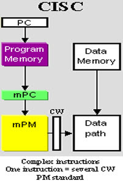
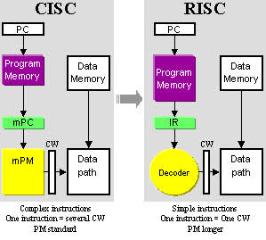

## Two different Architectures

-----------------------------------------------------------

**The strategy behind CISC (complex instruction set computer) architecture is to have a large set of instructions, including the complex ones.
The strategy behind RISC (reduced instruction set computer) architecture is to have a small set of instructions that do minimum number of simple operations.**

## Complex instruction set computer

*A complex instruction set computer (CISC /ˈsɪsk/) is a computer in which single instructions can execute several low-level operations (such as a load from memory, an arithmetic operation, and a memory store) or are capable of multi-step operations or addressing modes within single instructions. The term was retroactively coined in contrast to reduced instruction set computer (RISC)[1][2] and has therefore become something of an umbrella term for everything that is not RISC, from large and complex mainframe computers to simplistic microcontrollers where memory load and store operations are not separated from arithmetic instructions. A modern RISC processor can therefore be much more complex than, say, a modern microcontroller using a CISC-labeled instruction set, especially in the complexity of its electronic circuits, but also in the number of instructions or the complexity of their encoding patterns. The only typical differentiating characteristic is that most RISC designs use uniform instruction length for almost all instructions, and employ strictly separate load/store-instructions.*

*Examples of instruction set architectures that have been retroactively labeled CISC are System/360 through z/Architecture, the PDP-11 and VAX architectures, Data General Nova and many others. Well known microprocessors and microcontrollers that have also been labeled CISC in many academic publications include the Motorola 6800, 6809 and 68000-families; the Intel 8080, iAPX432 and x86-family; the Zilog Z80, Z8 and Z8000-families; the National Semiconductor 32016 and NS320xx-line; the MOS Technology 6502-family; the Intel 8051-family; and others.*

*Some designs have been regarded as borderline cases by some writers. For instance, the Microchip Technology PIC has been labeled RISC in some circles and CISC in others. The 6502 and 6809 have both been described as "RISC-like", although they have complex addressing modes as well as arithmetic instructions that operate on memory, contrary to the RISC-principles.*

## Reduced instruction set computer

*A reduced instruction set computer, or RISC (/rɪsk/), is one whose instruction set architecture (ISA) allows it to have fewer cycles per instruction (CPI) than a complex instruction set computer (CISC).[1] Various suggestions have been made regarding a precise definition of RISC, but the general concept is that such a computer has a small set of simple and general instructions, rather than a large set of complex and specialized instructions. For this reason RISC is sometimes given the backronym 'Relegate Interesting Stuff to the Compiler'. Another common RISC trait is their load/store architecture,[2] in which memory is accessed through specific instructions rather than as a part of most instructions.*

*Although a number of computers from the 1960s and '70s have been identified as forerunners of RISCs, the modern concept dates to the 1980s. In particular, two projects at Stanford University and the University of California, Berkeley are most associated with the popularization of this concept. Stanford's MIPS would go on to be commercialized as the successful MIPS architecture, while Berkeley's RISC gave its name to the entire concept and was commercialized as the SPARC. Another success from this era was IBM's effort that eventually led to the Power Architecture. As these projects matured, a wide variety of similar designs flourished in the late 1980s and especially the early 1990s, representing a major force in the Unix workstation market as well as for embedded processors in laser printers, routers and similar products.*

*The many varieties of RISC designs include ARC, Alpha, Am29000, ARM, Atmel AVR, Blackfin, i860, i960, M88000, MIPS, PA-RISC, Power ISA (including PowerPC), RISC-V, SuperH, and SPARC. In the 21st century, the use of ARM architecture processors in smartphones and tablet computers such as the iPad and Android devices provided a wide user base for RISC-based systems. RISC processors are also used in supercomputers such as the Sunway TaihuLight, which, as of October 2018, is the world's second fastest supercomputer as ranked by the TOP500 project.*

 =============================
## Pre. [Program Execution](execution.md)
## Next. [README](README.md)

=============================

## **Video for Two different Architectures** 

* [RISC vs CISC](https://www.youtube.com/watch?v=_EKgwOAAWZA)

## **Key terms**

+ [address bus](https://en.wikipedia.org/wiki/Address_bus)
+ [control bus](https://en.wikipedia.org/wiki/Control_bus)
+ [data bus](https://en.wikipedia.org/wiki/Databus)
+ [arithmetic logic unit](https://en.wikipedia.org/wiki/Arithmetic_logic_unit)
+ [cache memory](https://en.wikipedia.org/wiki/CPU_cache)
+ [data register](https://en.wikipedia.org/wiki/Memory_buffer_register)
+ [central processing unit](https://en.wikipedia.org/wiki/Central_processing_unit)
+ [CD-ROM](https://en.wikipedia.org/wiki/CD-ROM)
+ [interrupt](https://en.wikipedia.org/wiki/Interrupt)
+ [Serial controller](https://en.wikipedia.org/w/index.php?title=Serial_Communication_Controller&redirect=no)
+ [USB](https://en.wikipedia.org/wiki/USB)
+ [DMA](https://en.wikipedia.org/wiki/DMA)
+ [Machine cycle](https://en.wikipedia.org/wiki/Instruction_cycle)

## **Target Audience**

This tutorial is one part of Foundations of Computer Science. It is suitable for Computer Science or related majors freshmans or non Computer Science majors  juniors.

## **Copyright**

This tutorial is written by Honglei Wang

>Visit my Github---->[MyGithub](https://github.com/helenwang1610)

**Copyright@helenwang1610**

~~NEVER ILLEGAL USAGE~~
