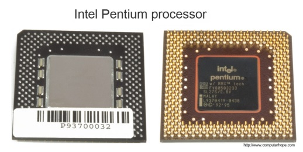
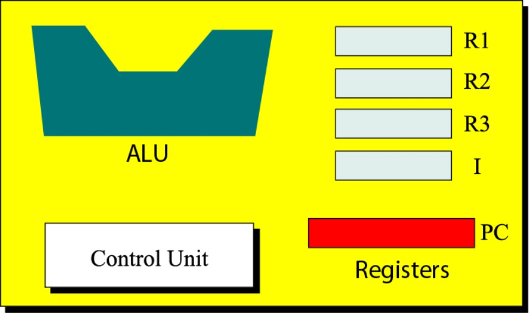
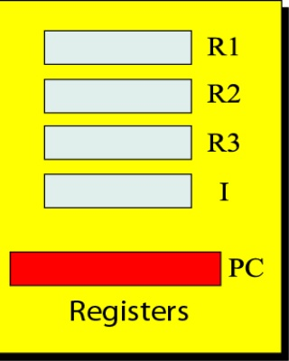
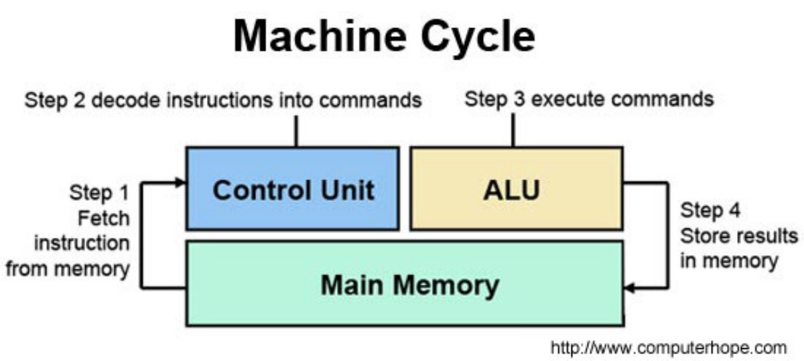

# Central Processing Unit

-----------------------------------------------------------

**CPU (pronounced sea-pea-you) is the Central Processing Unit of the computer. A computer's CPU handles all instructions it receives from hardware and softwarerunning on the computer.**

*The picture above is an example of what the top and bottom of an Intel Pentium processor may look. The processor is placed and secured into a compatible CPU socket found on the motherboard. Processors produce heat, so they are covered with a heat sink to keep them cool and running smoothly.*

*As you can see in the above picture, the CPU chip is usually in the shape of a square or rectangle and has one notched corner to help place the chip properly into the CPU socket. On the bottom of the chip are hundreds of connector pins that plug into each of the corresponding holes in the socket. Today, most CPU's resemble the picture shown above. However, Intel and AMD have also experimented with slot processors that were much larger and slid into a slot on the motherboard. Also, over the years, there have been dozens of different types of sockets on motherboards. Each socket only supports specific types of processors and each has its own pin layout.*

**Principal components of a CPU include the arithmetic logic unit (ALU) that performs arithmetic and logic operations, processor registers that supply operands to the ALU and store the results of ALU operations and a control unit that orchestrates the fetching (from memory) and execution of instructions by directing the coordinated operations of the ALU, registers and other components.**

*ALU performs 1. Arithmetic Operation; 2. Logic Operation.*
*Registers are fast stand-alone storage locations that hold data temporarily. There are three kinds of registers. They are 1. Data Register:  R1,R2,R3; 2. Instruction register:  I 3. Program Counter:   PC as example shows below.*

*Controlling is achieved through wires that can be on or off.*

*The machine cycle (also known as the fetch–decode–execute cycle or the fetch-execute cycle) is the basic operational process of a computer system. It is the process by which a computer retrieves a program instruction from its memory, determines what actions the instruction describes, and then carries out those actions. This cycle is repeated continuously by a computer's central processing unit (CPU), from boot-up until the computer has shut down.* 

=============================
## Pre. [README](README.md)

## Next. [Main Memory](memory.md)

=============================

## **Video for Central Processing Unit** 

* [Central Processing Unit](https://www.youtube.com/watch?v=cEQXWsM5bfQ)

## **Key terms**

+ [address bus](https://en.wikipedia.org/wiki/Address_bus)
+ [control bus](https://en.wikipedia.org/wiki/Control_bus)
+ [data bus](https://en.wikipedia.org/wiki/Databus)
+ [arithmetic logic unit](https://en.wikipedia.org/wiki/Arithmetic_logic_unit)
+ [cache memory](https://en.wikipedia.org/wiki/CPU_cache)
+ [data register](https://en.wikipedia.org/wiki/Memory_buffer_register)
+ [central processing unit](https://en.wikipedia.org/wiki/Central_processing_unit)
+ [CD-ROM](https://en.wikipedia.org/wiki/CD-ROM)
+ [interrupt](https://en.wikipedia.org/wiki/Interrupt)
+ [Serial controller](https://en.wikipedia.org/w/index.php?title=Serial_Communication_Controller&redirect=no)
+ [USB](https://en.wikipedia.org/wiki/USB)
+ [DMA](https://en.wikipedia.org/wiki/DMA)
+ [Machine cycle](https://en.wikipedia.org/wiki/Instruction_cycle)

## **Target Audience**

This tutorial is one part of Foundations of Computer Science. It is suitable for Computer Science or related majors freshmans or non Computer Science majors  juniors.

## **Copyright**

This tutorial is written by Honglei Wang

>Visit my Github---->[MyGithub](https://github.com/helenwang1610)

**Copyright@helenwang1610**

~~NEVER ILLEGAL USAGE~~
