# INPUT / OUTPUT

-----------------------------------------------------------

**An input/output (I/O) device is a hardware device that has the ability to accept inputted, outputted or other processed data. It also can acquire respective media data as input sent to a computer or send computer data to storage media as storage output. An I/O device is also known as an IO device.**

## Nonstorage devices

Input/Output devices can be divided into two broad categories:nonstorage and storage devices.
Nonstorage devices allow the CPU/memory to communicate with the outside world but they can not store information.

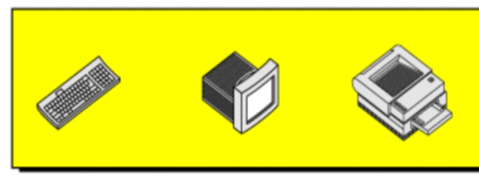

### Keyboard

*Each key on the board has a little electrical switch under it. When you press a key (1), its switch completes a certain electrical circuit (2). A processor (like a tiny computer) inside the keyboard records which circuits were completed and in what order. Then it sends that information to your computer.
Your computer is programmed to “know” what to do with that information. For example, when it gets the signal that the backspace key was pressed, it knows to erase a keystroke.*

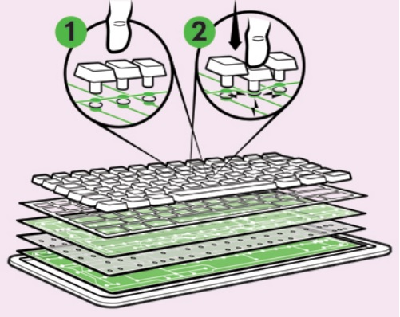

## Storage devices

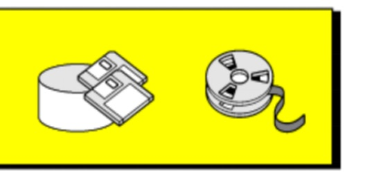

*Storage devices, although classified as I/O devices, can store large amounts of information to be retrieved at a later time.
We categorize them as either magnetic or optical.*

### Disk

*Disk storage (also sometimes called drive storage) is a general category of storage mechanisms where data is recorded by various electronic, magnetic, optical, or mechanical changes to a surface layer of one or more rotating disks. A disk drive is a device implementing such a storage mechanism. Notable types are the hard disk drive (HDD) containing a non-removable disk, the floppy disk drive (FDD) and its removable floppy disk, and various optical disc drives (ODD) and associated optical disc media.*

*Digital disk drives are block storage devices. Each disk is divided into logical blocks (collection of sectors). Blocks are addressed using their logical block addresses (LBA). Read from or writing to disk happens at the granularity of blocks.*

*Originally the disk capacity was quite low and has been improved in one of several ways. Improvements in mechanical design and manufacture allowed smaller and more precise heads, meaning that more tracks could be stored on each of the disks. Advancements in data compression methods permitted more information to be stored in each of the individual sectors.*

*The drive stores data onto cylinders, heads, and sectors. The sectors unit is the smallest size of data to be stored in a hard disk drive and each file will have many sectors units assigned to it. The smallest entity in a CD is called a frame, which consists of 33 bytes and contains six complete 16-bit stereo samples (two bytes × two channels × six samples = 24 bytes). The other nine bytes consist of eight CIRC error-correction bytes and one subcode byte used for control and display.*

*The information is sent from the computer processor to the BIOS into a chip controlling the data transfer. This is then sent out to the hard drive via a multi-wire connector. Once the data is received onto the circuit board of the drive, they are translated and compressed into a format that the individual drive can use to store onto the disk itself. The data is then passed to a chip on the circuit board that controls the access to the drive. The drive is divided into sectors of data stored onto one of the sides of one of the internal disks. An HDD with two disks internally will typically store data on all four surfaces.*

*The hardware on the drive tells the actuator arm where it is to go for the relevant track and the compressed information is then sent down to the head which changes the physical properties, optically or magnetically for example, of each byte on the drive, thus storing the information. A file is not stored in a linear manner, rather, it is held in the best way for quickest retrieval.*

 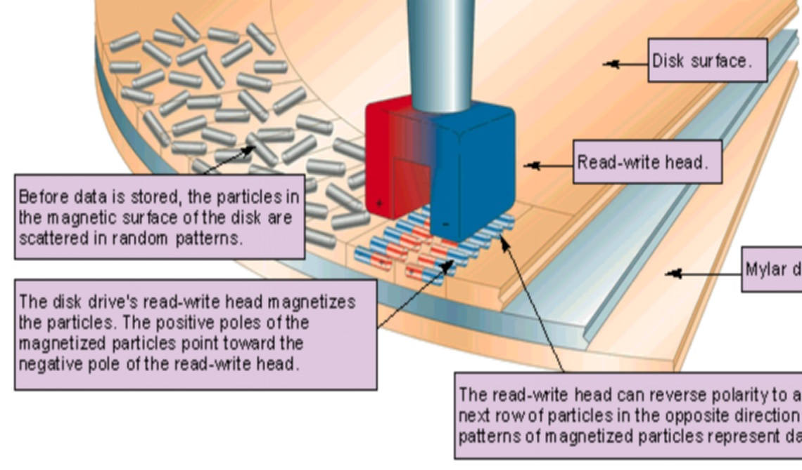
 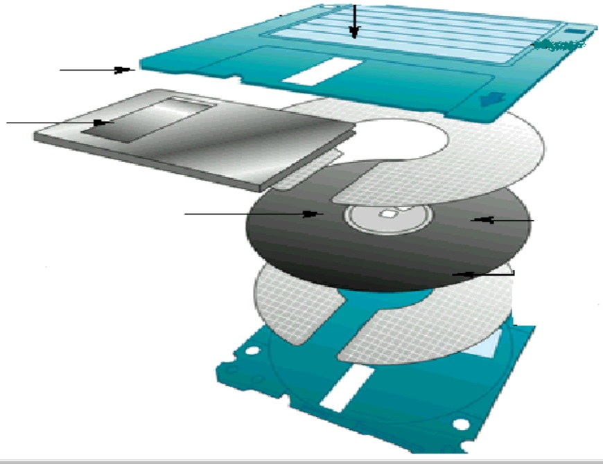
 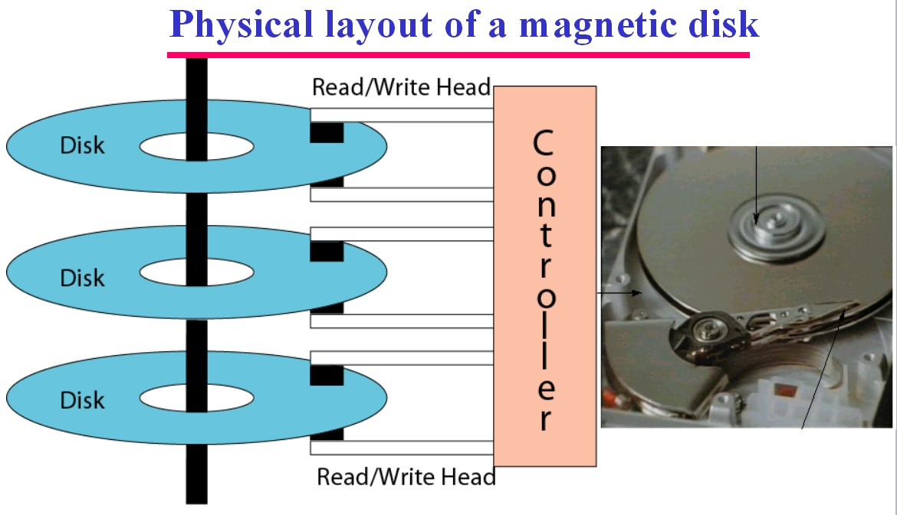
  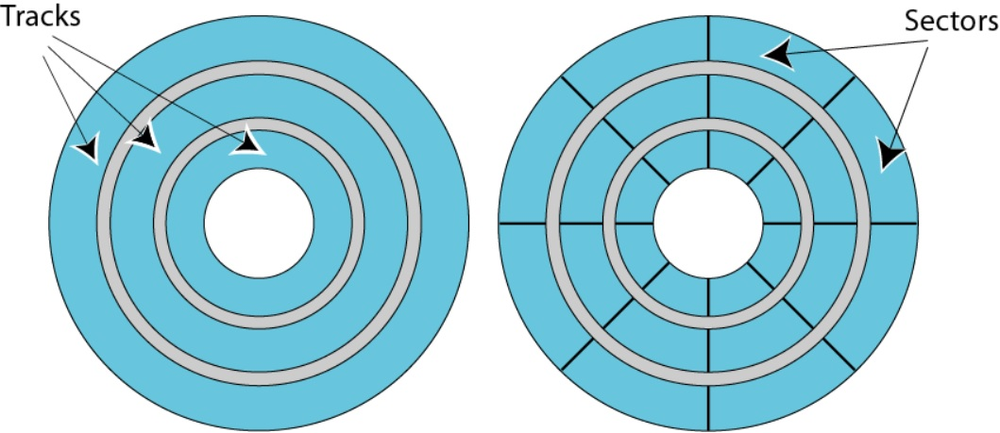
  
 ### Tape 
 
*Magnetic tape data storage is a system for storing digital information on magnetic tape using digital recording. Modern magnetic tape is most commonly packaged in cartridges and cassettes. The device that performs writing or reading of data is a tape drive. Autoloaders and tape libraries automate cartridge handling. For example, a common cassette-based format is Linear Tape-Open, which comes in a variety of densities and is manufactured by several companies.*

*In a typical format, data is written to tape in blocks with inter-block gaps between them, and each block is written in a single operation with the tape running continuously during the write. However, since the rate at which data is written or read to the tape drive is not deterministic, a tape drive usually has to cope with a difference between the rate at which data goes on and off the tape and the rate at which data is supplied or demanded by its host.*

*Tape is characterized by sequential access to data. While tape can provide fast sequential data transfers, it takes tens of seconds to load a cassette and position the tape head to an arbitrary place. By contrast, hard disk technology can perform the equivalent action in tens of milliseconds (3 orders of magnitude faster) and can be thought of as offering random access to data.*

 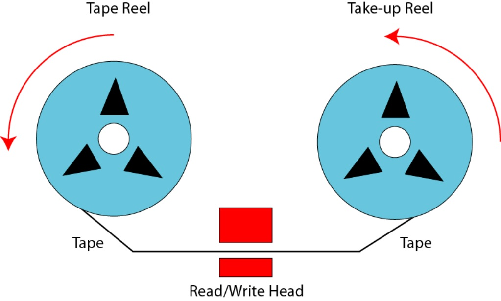
 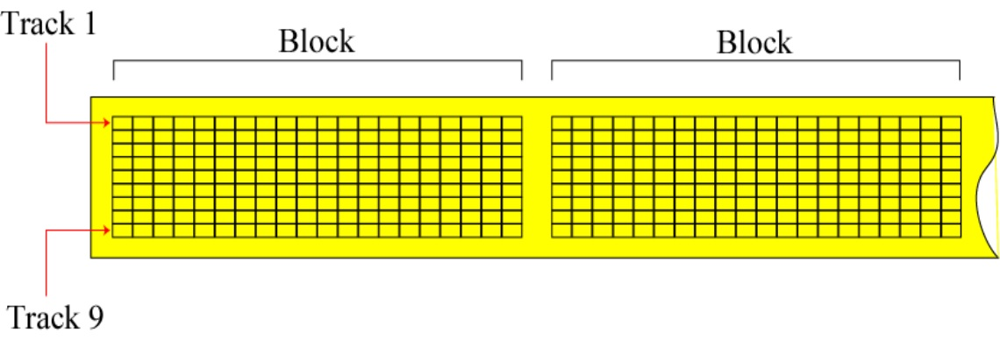
 
 ### Optical Storage Devices

*Optical storage is the storage of data on an optically readable medium. Data is recorded by making marks in a pattern that can be read back with the aid of light, usually a beam of laser light precisely focused on a spinning optical disc. An older example of optical storage that does not require the use of computers, is microform. There are other means of optically storing data and new methods are in development. An optical disc drive is a device in a computer that can read CD-ROMs or other optical discs, such as DVDs and Blu-ray discs. Optical storage differs from other data storage techniques that make use of other technologies such as magnetism, such as floppy disks and hard disks, or semiconductors, such as flash memory and ROM.*

*Optical storage can range from a single drive reading a single CD-ROM to multiple drives reading multiple discs such as an optical jukebox. Single CDs (compact discs) can hold around 700 MB (megabytes) and optical jukeboxes can hold much more. Single-layer DVDs can hold 4.7 GB, while dual-layered can hold 8.5 GB. This can be doubled to 9.4 GB and 17 GB by making the DVDs double sided, with readable surfaces on both sides of the disc. HD DVDs were able to store 15 GB with a single-layer and 30 GB with a dual-layer. Blu-ray discs, which won the HDTV optical format war by defeating HD DVDs, can hold 25 GB for single-layer, 50 GB for dual-layer and up to 128 GB for quad-layer discs.*

 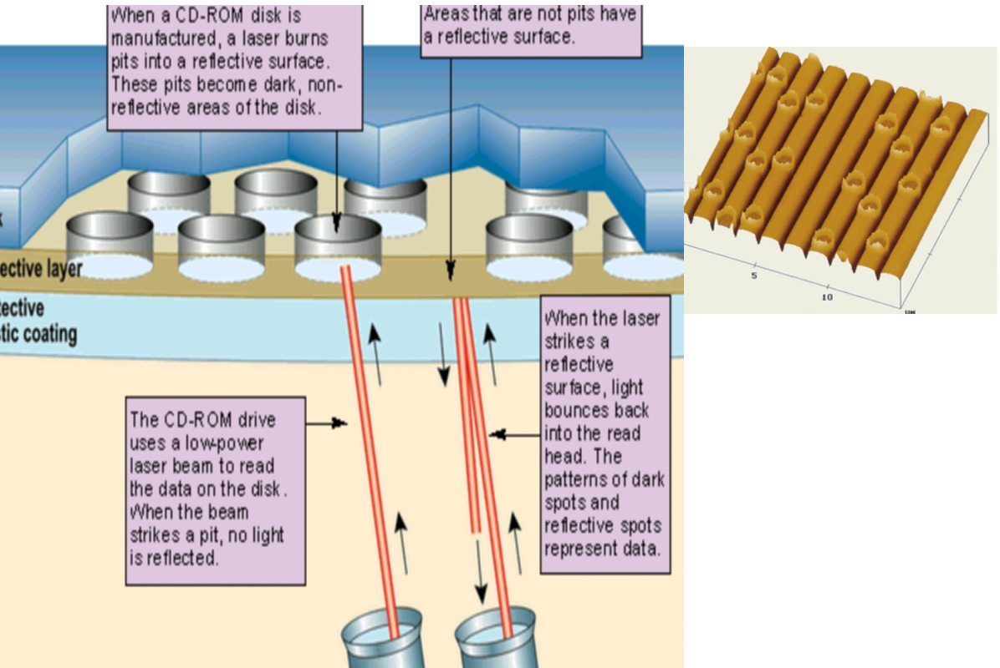
 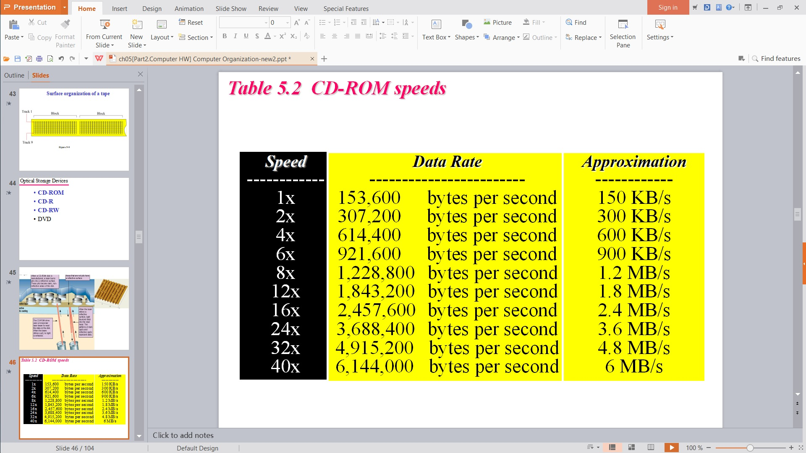

=============================
## Pre. [Main Memory](memory.md)

## Next. [Subsystem Interconnection](subsystem.md)

=============================

## **Video for INPUT / OUTPUT** 

* [Input/Output Devices](https://www.youtube.com/watch?v=KzxVZgO-iOA)
* [How Computers Work: CPU, Memory, Input & Output](https://www.youtube.com/watch?v=DKGZlaPlVLY&t=61s)

## **Key terms**

+ [address bus](https://en.wikipedia.org/wiki/Address_bus)
+ [control bus](https://en.wikipedia.org/wiki/Control_bus)
+ [data bus](https://en.wikipedia.org/wiki/Databus)
+ [arithmetic logic unit](https://en.wikipedia.org/wiki/Arithmetic_logic_unit)
+ [cache memory](https://en.wikipedia.org/wiki/CPU_cache)
+ [data register](https://en.wikipedia.org/wiki/Memory_buffer_register)
+ [central processing unit](https://en.wikipedia.org/wiki/Central_processing_unit)
+ [CD-ROM](https://en.wikipedia.org/wiki/CD-ROM)
+ [interrupt](https://en.wikipedia.org/wiki/Interrupt)
+ [Serial controller](https://en.wikipedia.org/w/index.php?title=Serial_Communication_Controller&redirect=no)
+ [USB](https://en.wikipedia.org/wiki/USB)
+ [DMA](https://en.wikipedia.org/wiki/DMA)
+ [Machine cycle](https://en.wikipedia.org/wiki/Instruction_cycle)

## **Target Audience**

This tutorial is one part of Foundations of Computer Science. It is suitable for Computer Science or related majors freshmans or non Computer Science majors  juniors.

## **Copyright**

This tutorial is written by Honglei Wang

>Visit my Github---->[MyGithub](https://github.com/helenwang1610)

**Copyright@helenwang1610**

~~NEVER ILLEGAL USAGE~~
