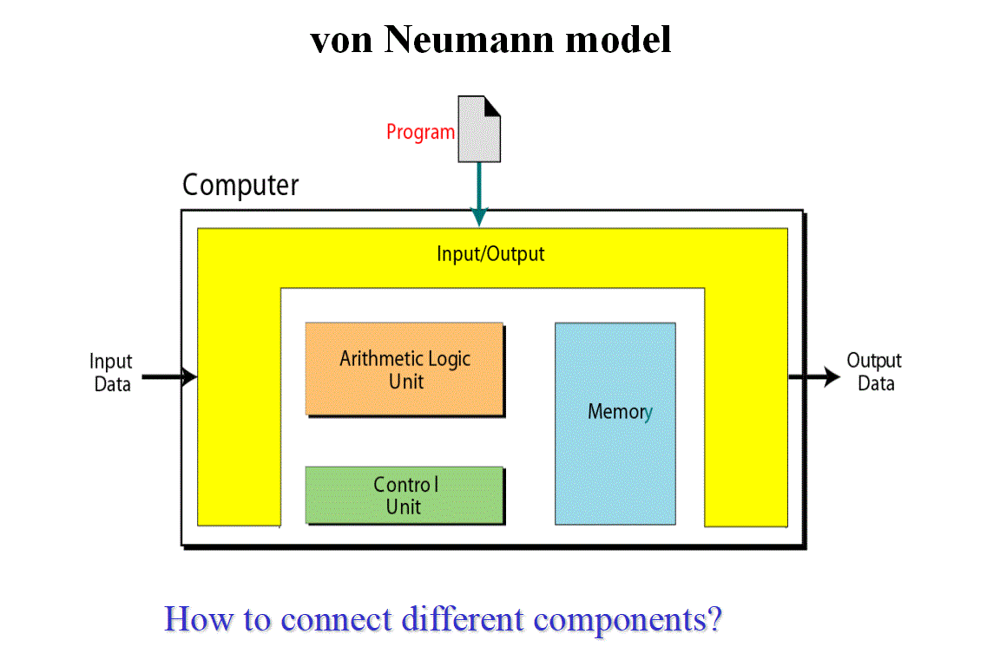
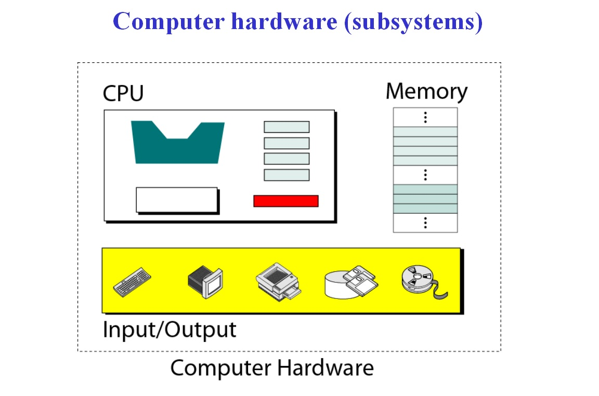

# **README**

--------------------------------------------------------------------
**Hi, Welcome to  this tutorial!**
This tutorial is **Computer Organization**. You're going to a tour of all the basic concepts of Computer Organization. If you join me and read along all parts of this tutorial, you should be able to 

1. *Distinguish between the **three components** of a computer hardware.*
2. *List the functionality of each component.*
3. *Understand **memory addressing** and calculate the number  of  bytes for a specified purpose.*
4. *Distinguish between different types of memories.*
5. *Understand how each input/output device works.*
6. *Understand the systems used to **connect** different components together.*
7. *Understand the **addressing system** for input/output devices.*
8. *Understand the **program execution** and **machine cycles**.* 
9. *Distinguish between **programmed I/O**, **interrupt-driven I/O** and **direct memory access (DMA)***
10. *Understand the two major architectures used to define 
the instruction sets of  a computer: **CISC** and **RISC**.*

---------------------------------------------------------------------

## 1. [Central Processing Unit](CPU.md)

## 2. [Main Memory](memory.md)

## 3. [Input/Output](IO.md)

## 4. [Subsystem Interconnection](subsystem.md)

## 5. [Program Execution](execution.md)

## 6. [Two different Architectures](CISC_RISC.md)

## **Video For README**

* [Computer Organization and Architecture](https://www.youtube.com/watch?v=t6_yhVTDfUE)

## **Von Neumann Model**
+ 
+ 

## **Key terms**

+ [address bus](https://en.wikipedia.org/wiki/Address_bus)
+ [control bus](https://en.wikipedia.org/wiki/Control_bus)
+ [data bus](https://en.wikipedia.org/wiki/Databus)
+ [arithmetic logic unit](https://en.wikipedia.org/wiki/Arithmetic_logic_unit)
+ [cache memory](https://en.wikipedia.org/wiki/CPU_cache)
+ [data register](https://en.wikipedia.org/wiki/Memory_buffer_register)
+ [central processing unit](https://en.wikipedia.org/wiki/Central_processing_unit)
+ [CD-ROM](https://en.wikipedia.org/wiki/CD-ROM)
+ [interrupt](https://en.wikipedia.org/wiki/Interrupt)
+ [Serial controller](https://en.wikipedia.org/w/index.php?title=Serial_Communication_Controller&redirect=no)
+ [USB](https://en.wikipedia.org/wiki/USB)
+ [DMA](https://en.wikipedia.org/wiki/DMA)
+ [Machine cycle](https://en.wikipedia.org/wiki/Instruction_cycle)

## **Target Audience**

This tutorial is one part of Foundations of Computer Science. It is suitable for Computer Science or related majors freshmans or non Computer Science majors  juniors.

## **Copyright**

This tutorial is written by Honglei Wang

>Visit my Github---->[MyGithub](https://github.com/helenwang1610)

**Copyright@helenwang1610**

~~NEVER ILLEGAL USAGE~~

