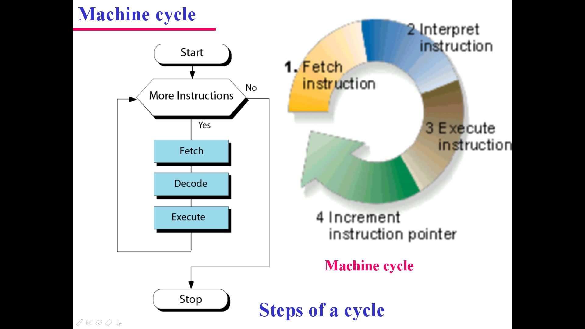
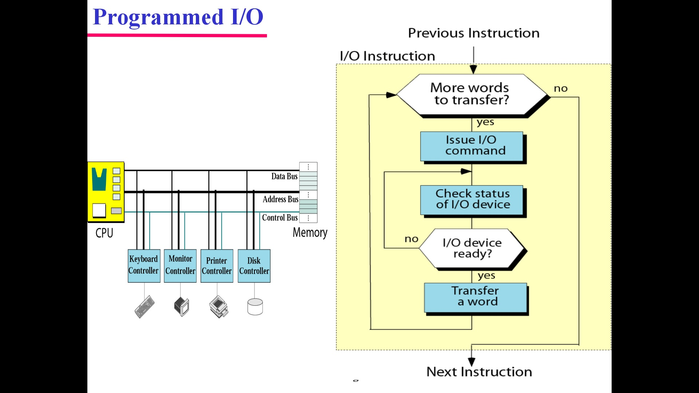
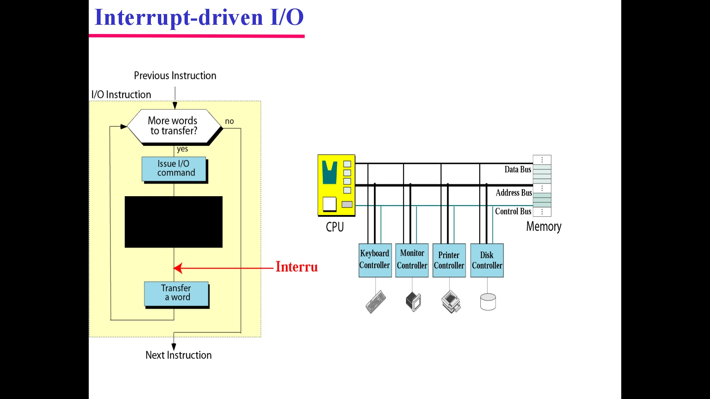
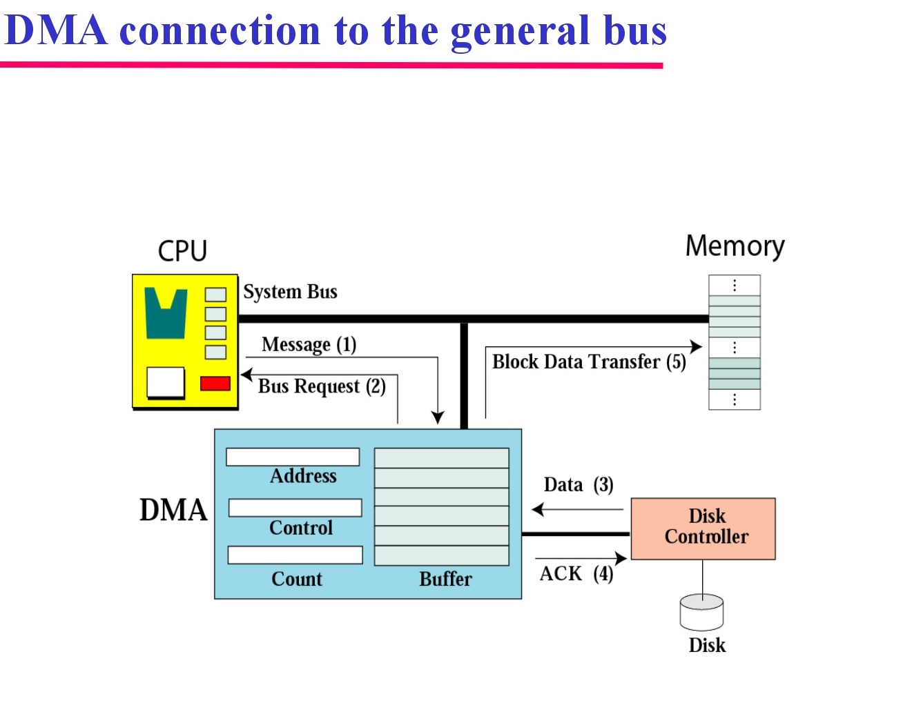
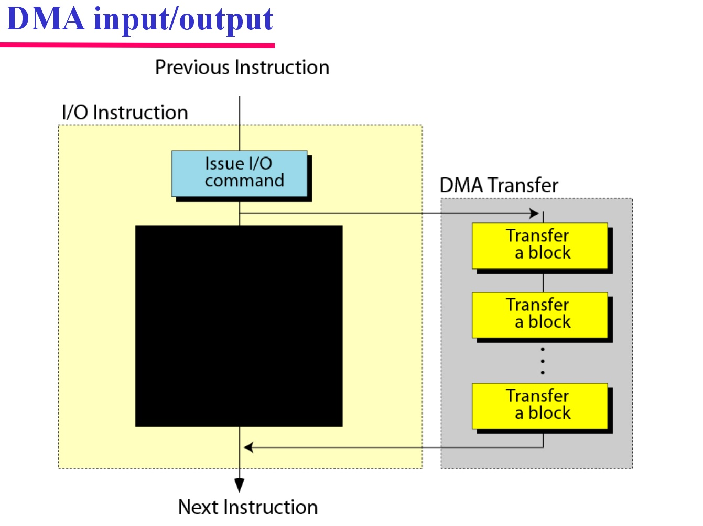

# Program Execution

-----------------------------------------------------------

**Execution in computer and software engineering is the process by which a computer or virtual machine executes the instructions of a computer program. Each instruction of a program is a description of a specific action to be carried out in order for a specific problem to be solved; as instructions of a program and therefore the actions they describe are being carried out by an executing machine, specific effects are produced in accordance to the semantics of the instructions being executed.**

**Programs for a computer may be executed in a batch process without human interaction or a user may type commands in an interactive session of an interpreter. In this case, the "commands" are simply program instructions, whose execution is chained together.**

**The term run is used almost synonymously. A related meaning of both "to run" and "to execute" refers to the specific action of a user starting (or launching or invoking) a program, as in "Please run the application."**

## Machine cycle

*The instruction cycle (also known as the fetch–decode–execute cycle or the fetch-execute cycle) is the basic operational process of a computer system. It is the process by which a computer retrieves a program instruction from its memory, determines what actions the instruction describes, and then carries out those actions. This cycle is repeated continuously by a computer's central processing unit (CPU), from boot-up until the computer has shut down. *

*A diagram of the instruction cycle below. In simpler CPUs the instruction cycle is executed sequentially, each instruction being processed before the next one is started. In most modern CPUs the instruction cycles are instead executed concurrently, and often in parallel, through an instruction pipeline: the next instruction starts being processed before the previous instruction has finished, which is possible because the cycle is broken up into separate steps.*

  **[Machine cycle](https://www.youtube.com/watch?v=urqPobwPOzs)**

## Programmed I/O

*TProgrammed input/output (PIO) is a method of transferring data between the CPU and a peripheral, such as a network adapter or an ATA storage device.

For programmed I/O, the software that is running on the CPU uses instructions to perform data transfers to or from an I/O device. This is in contrast to Direct Memory Access (DMA) transfers. The term Programmed I/O can refer to either MMIO or PMIO. Port-mapped I/O (PMIO) refers to a special address space outside of normal memory that is accessed with instructions such as IN and OUT. Memory-mapped I/O[1] (MMIO) refers to I/O devices being allocated addresses inside the normal Von Neumann address space that is primarily used for program and data. Such I/O is done using instructions such as LOAD and STORE. PMIO was very useful for early microprocessors with small address spaces, since the valuable resource was not consumed by the I/O devices.*

*The best known example of a PC device that uses programmed I/O is the ATA interface; however, this interface can also be operated in any of several DMA modes. Many older devices in a PC also use PIO, including legacy serial ports, legacy parallel ports when not in ECP mode, the PS/2 keyboard and mouse ports, legacy MIDI and joystick ports, the interval timer, and older network interfaces.*

## Interrupt-driven I/O

*An interrupt request (IRQ) is an asynchronous signal sent from a device to a processor indicating that in order to process a request, attention is required. A hardware IRQ is induced by a hardware peripheral or device request, whereas a software IRQ is induced by a software instruction. Both result in processor status savings, and revert to serving the IRQ using an interrupt handler routine.*

## DMA connection to the general bus

*Direct memory access (DMA) is a method that allows an input/output (I/O) device to send or receive data directly to or from the main memory, bypassing the CPU to speed up memory operations. The process is managed by a chip known as a DMA controller (DMAC).*

 =============================
## Pre. [Subsystem Interconnection](subsystem.md)

## Next. [Two different Architectures](CISC_RISC.md)

=============================

## **Video for Program Execution** 

* [Machine cycle](https://www.youtube.com/watch?v=urqPobwPOzs)
* [memory-mapped i/o](https://www.youtube.com/watch?v=aT5XMOrid7Y)
* [IRQ, DMA & Address Ports](https://www.youtube.com/watch?v=aPKXmGkRxQ8)

## **Key terms**

+ [address bus](https://en.wikipedia.org/wiki/Address_bus)
+ [control bus](https://en.wikipedia.org/wiki/Control_bus)
+ [data bus](https://en.wikipedia.org/wiki/Databus)
+ [arithmetic logic unit](https://en.wikipedia.org/wiki/Arithmetic_logic_unit)
+ [cache memory](https://en.wikipedia.org/wiki/CPU_cache)
+ [data register](https://en.wikipedia.org/wiki/Memory_buffer_register)
+ [central processing unit](https://en.wikipedia.org/wiki/Central_processing_unit)
+ [CD-ROM](https://en.wikipedia.org/wiki/CD-ROM)
+ [interrupt](https://en.wikipedia.org/wiki/Interrupt)
+ [Serial controller](https://en.wikipedia.org/w/index.php?title=Serial_Communication_Controller&redirect=no)
+ [USB](https://en.wikipedia.org/wiki/USB)
+ [DMA](https://en.wikipedia.org/wiki/DMA)
+ [Machine cycle](https://en.wikipedia.org/wiki/Instruction_cycle)

## **Target Audience**

This tutorial is one part of Foundations of Computer Science. It is suitable for Computer Science or related majors freshmans or non Computer Science majors  juniors.

## **Copyright**

This tutorial is written by Honglei Wang

>Visit my Github---->[MyGithub](https://github.com/helenwang1610)

**Copyright@helenwang1610**

~~NEVER ILLEGAL USAGE~~
