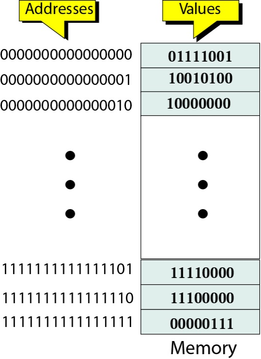
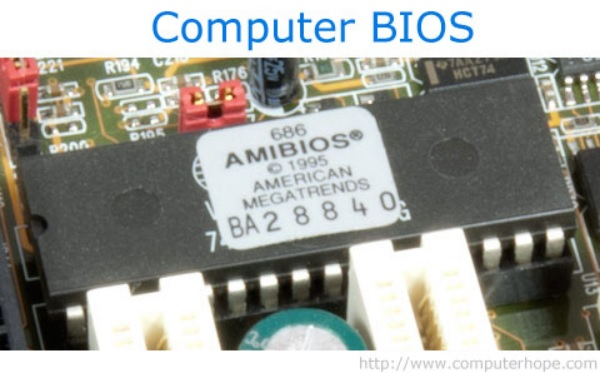
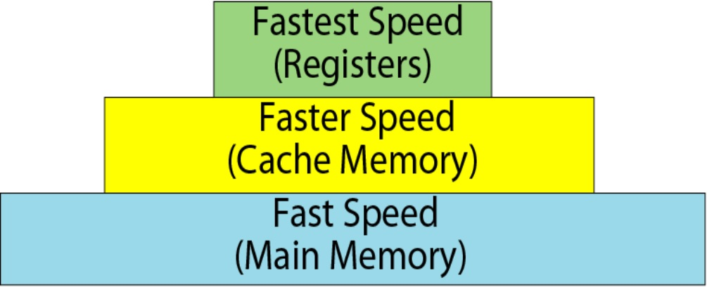
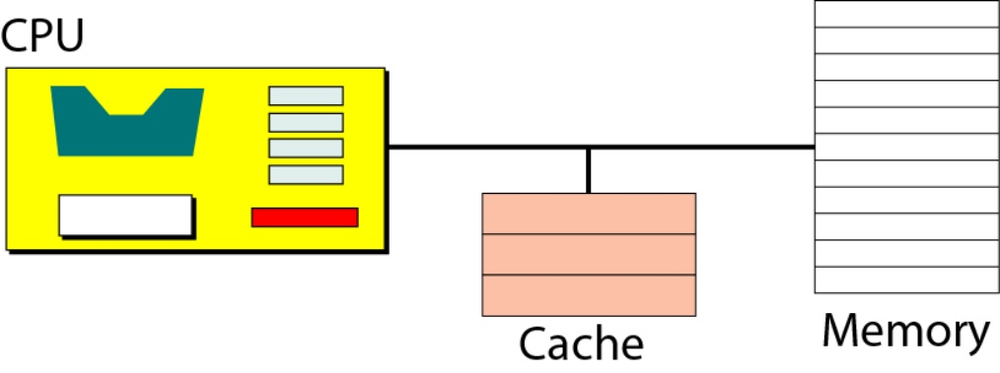
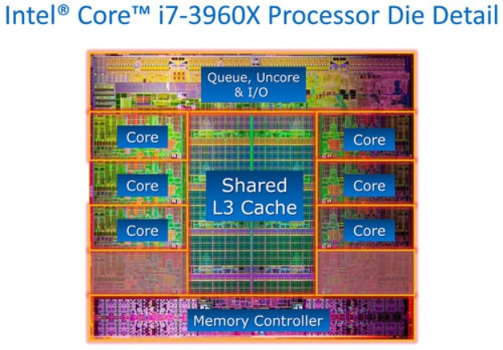

## Main Memory

-----------------------------------------------------------

**Alternatively referred to as primary storage, primary memory, or system memory,Random Access Memory (RAM) is a hardware device that allows information to be stored and retrieved on a computer. RAM is usually associated with DRAM, which is a type of memory module. Because information is accessed randomly instead of sequentially like it is on a CD or hard drive, the computer can access the data much faster. However, unlike ROM or the hard drive, RAM is a volatile memory and requires power to keep the data accessible. If the computer is turned off, all data contained in RAM is lost.**

*An address space is a range of logical space on a memory chip, each byte of data has its own address where it can be stored and then located at a later time. There are limits to what the address can be, based upon the physical limitations of the device, as well as arbitrary limits that are used to separate certain types of data from one another.*

**What’s the difference between a word and a byte?**
*Word: Data are transferred to and from memory in groups of bits called words.   
Byte: 8 bits word.*
*Memory addresses are defined usingunsigned binary integers.*

### Memory Types

Two types of memory : RAM and ROM.
RAM(random access memory):
(1)RAM can be read from and written to by the user.
(2)RAM is volatile.
SRAM(static RAM):flip-flop gates, no need for refreshing.
DRAM(dynamic RAM):capacitor.need to be refreshed periodically.
ROM:(Read-only memory)
(1)The user is allowed to read but not write to ROM.
(2)ROM is nonvolatile.
*A simple example of ROM is the cartridge used with video game consoles, which allows one system to run multiple games. Another example of ROM is EEPROM, which is a programmable ROM used for the computer BIOS, as shown in the picture below.*

+ [PROM](https://en.wikipedia.org/wiki/Prom_(disambiguation))
+ [EPROM](https://en.wikipedia.org/wiki/EPROM)
+ [EEPROM](https://en.wikipedia.org/wiki/EEPROM)

### Memory hierarchy

### Cache

*Pronounced like the physical form of U.S. currency ("cash"), cache is a high-speed access area that can be a reserved section of main memory or storage device. The two main types of cache are memory cache and disk cache.*

*Memory cache is a portion of the high-speed static RAM (SRAM) and is effective because most programs access the same data or instructions over and over. By keeping as much of this information as possible in SRAM, the computer avoids accessing the slower DRAM, making the computer perform faster and more efficiently. Today, most computers come with L3 cache or L2 cache, while older computers included only L1 cache. Below is an example of the Intel i7 processor and its shared L3 cache.*

=============================
#### Pre. [CPU](CPU.md)

#### Next. [Input/Output](IO.md)

=============================

#### **Video** 

* [Memory](https://www.youtube.com/watch?v=T4VVC3eeZI0)
* [How does Computer Work?](https://www.youtube.com/watch?v=DKGZlaPlVLY)

## **Key terms**

+ [address bus](https://en.wikipedia.org/wiki/Address_bus)
+ [control bus](https://en.wikipedia.org/wiki/Control_bus)
+ [data bus](https://en.wikipedia.org/wiki/Databus)
+ [arithmetic logic unit](https://en.wikipedia.org/wiki/Arithmetic_logic_unit)
+ [cache memory](https://en.wikipedia.org/wiki/CPU_cache)
+ [data register](https://en.wikipedia.org/wiki/Memory_buffer_register)
+ [central processing unit](https://en.wikipedia.org/wiki/Central_processing_unit)
+ [CD-ROM](https://en.wikipedia.org/wiki/CD-ROM)
+ [interrupt](https://en.wikipedia.org/wiki/Interrupt)
+ [Serial controller](https://en.wikipedia.org/w/index.php?title=Serial_Communication_Controller&redirect=no)
+ [USB](https://en.wikipedia.org/wiki/USB)
+ [DMA](https://en.wikipedia.org/wiki/DMA)
+ [Machine cycle](https://en.wikipedia.org/wiki/Instruction_cycle)

## **Target Audience**

This tutorial is one part of Foundations of Computer Science. It is suitable for Computer Science or related majors freshmans or non Computer Science majors  juniors.

## **Copyright**

This tutorial is written by Honglei Wang

>Visit my Github---->[MyGithub](https://github.com/helenwang1610)

**Copyright@helenwang1610**

~~NEVER ILLEGAL USAGE~~
