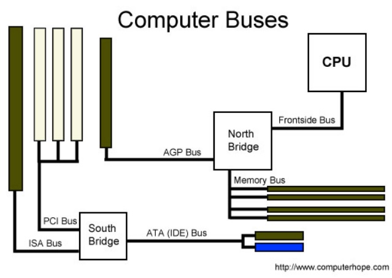
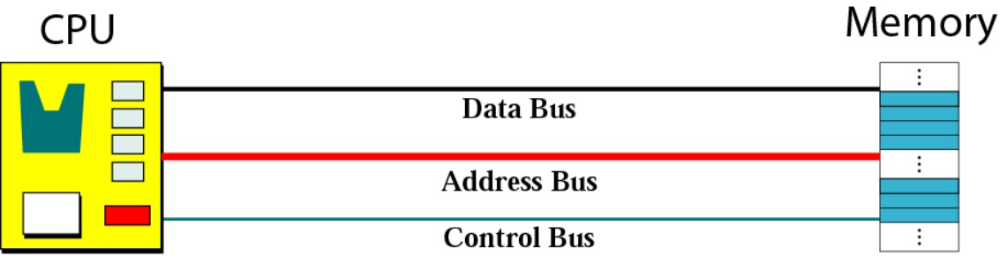
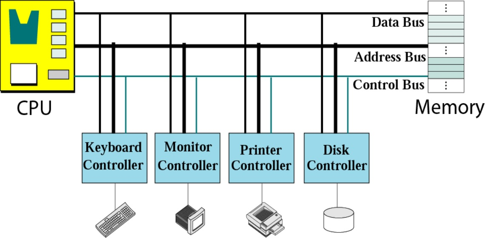
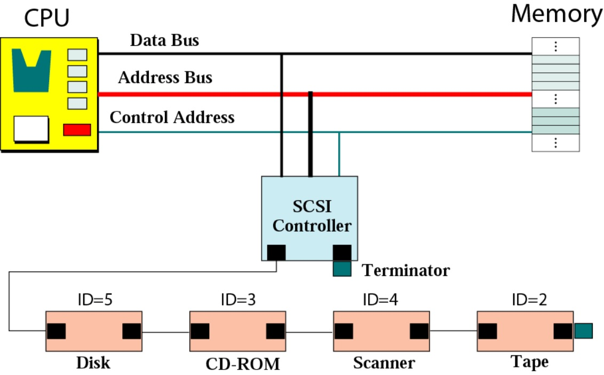
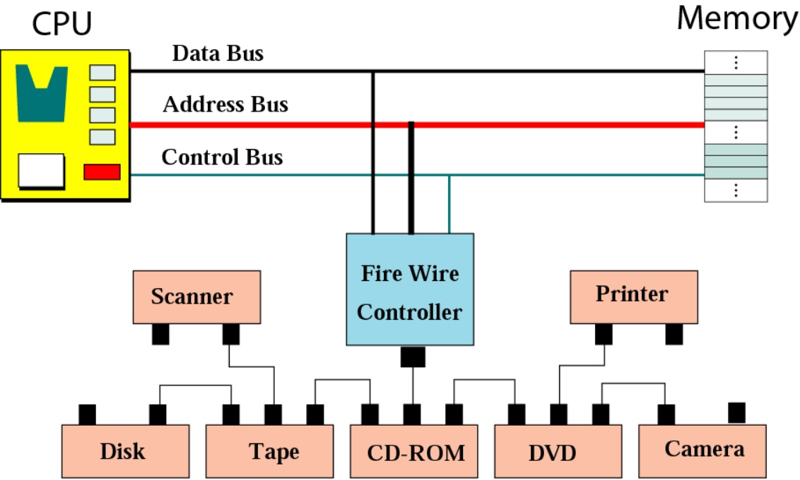
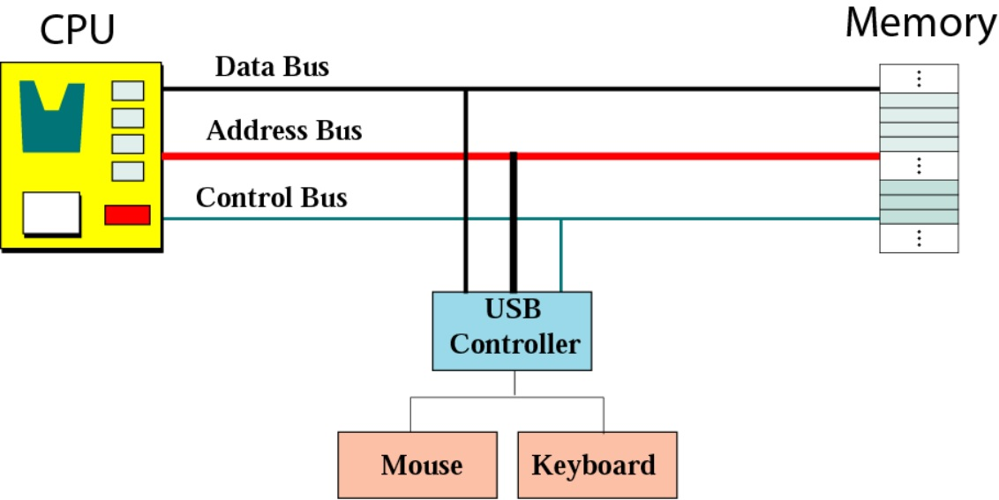
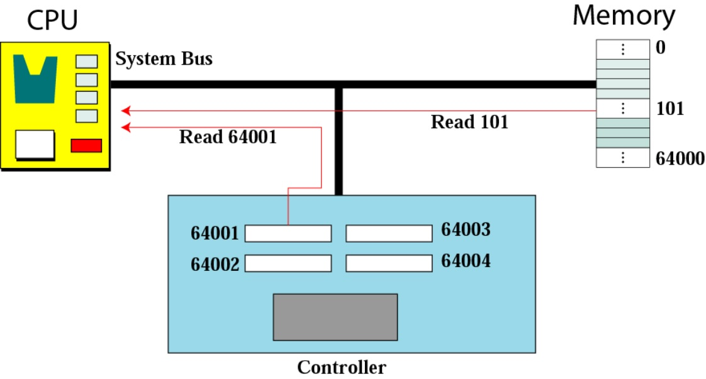
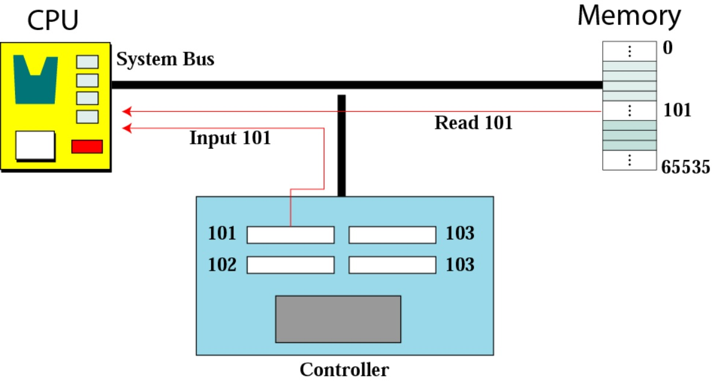

## Subsystem Interconnection

-----------------------------------------------------------

**When referring to a computer, the bus also known as the address bus, data bus, or local bus is a data connection between two or more devices connected to the computer. For example, a bus enables a computer processor to communicate with the memory or a video card to communicate with the memory.**

### Connecting CPU and memory using three buses

+ [address bus](https://en.wikipedia.org/wiki/Address_bus)
+ [control bus](https://en.wikipedia.org/wiki/Control_bus)
+ [data bus](https://en.wikipedia.org/wiki/Databus)

### Connecting I/O devices to the buses

*The bus contains multiple wires (signal lines) that contain addressing information that describes the memory location of where the data is being sent or where it is being retrieved. Each wire in the bus carries a single bit of information, which means the more wires a bus has the more information it can address. For example, a computer with a 32-bit address bus can address 4GB of memory, and a computer with a 36-bit bus can address 64GB of memory. *

*A bus is capable of being a parallel or serial bus and today all computers utilize two bus types, an internal bus or local bus and an external bus, also called the expansion bus. An internal bus enables communication between internal components such as a video card and memory. An external bus is capable of communicating with external components such as a USB or SCSI device.*

*A computer or device's bus speed is listed as a MHz, e.g. 100MHz FSB. The throughput of a bus is measured in bits per second or megabytes per second.*

### Controllers

Controllers or interface:can be a serial or parallel device.
A serial controller has only one wire connection to the device.
A parallel controller has several connections to the device so that several bits can be transferred at a time.

#### SCSI Controller

*A SCSI controller is a device used to connect one or more other SCSI devices to a computer bus. It is commonly called a SCSI controller, which is not strictly correct as any component understanding the SCSI protocol can be called a controller. In this sense all SCSI devices have a SCSI controller built into them, while host adapters (unlike, for example, a hard disk or CD-ROM) bear responsibility for transferring data between the SCSI bus and the computer's input/output bus. SCSI adapters serve as a worthy adapter for FireWire Ports.*

*Most modern SCSI host adapters are PCI cards, either 32-bit or 64-bit. Older ones were based on the 16-bit ISA bus or the transitional 32-bit VESA and EISA buses. It is not uncommon for a SCSI host adapter to be built into a PC motherboard as an integral part, however this typically makes the board quite expensive and it is more usual to retain the SCSI host adapter as a separate component which can be easily replaced or transferred to another machine.*

#### FireWire/USB controller

*A host controller interface (USB, FireWire) is a register-level interface that enables a host controller for USB or IEEE 1394 hardware to communicate with a host controller driver in software. The driver software is typically provided with an operating system of a personal computer, but may also be implemented by application-specific devices such as a microcontroller.

*On the expansion card or motherboard controller, this involves much custom logic, with digital logic engines in the motherboard's controller chip, plus analog circuitry managing the high-speed differential signals. On the software side, it requires a device driver (called a Host Controller Driver, or HCD).*

#### Memory mapped and Isolated I/O addressing

*Memory Mapped I/O and Isolated I/O are two methods of performing input-output operations between CPU and installed peripherals in the system. Memory mapped I/O uses the same address bus to connect both primary memory and memory of hardware devices. Thus the instruction to address a section or portion or segment of RAM can also be used to address a memory location of a hardware device.

*On the other hand, isolated I/O uses separate instruction classes to access primary memory and device memory. In this case, I/O devices have separate address space either by separate I/O pin on CPU or by entire separate bus. As it separates general memory addresses with I/O devices, it is called isolated I/O.*

 
 
 
 =============================
#### Pre. [Input/Output](IO.md)

#### Next. [Program Execution](execution.md)

=============================

#### **Video** 

* [COMPUTER BUSES](https://www.youtube.com/watch?v=5V3ibIib67E)

## **Key terms**

+ [address bus](https://en.wikipedia.org/wiki/Address_bus)
+ [control bus](https://en.wikipedia.org/wiki/Control_bus)
+ [data bus](https://en.wikipedia.org/wiki/Databus)
+ [arithmetic logic unit](https://en.wikipedia.org/wiki/Arithmetic_logic_unit)
+ [cache memory](https://en.wikipedia.org/wiki/CPU_cache)
+ [data register](https://en.wikipedia.org/wiki/Memory_buffer_register)
+ [central processing unit](https://en.wikipedia.org/wiki/Central_processing_unit)
+ [CD-ROM](https://en.wikipedia.org/wiki/CD-ROM)
+ [interrupt](https://en.wikipedia.org/wiki/Interrupt)
+ [Serial controller](https://en.wikipedia.org/w/index.php?title=Serial_Communication_Controller&redirect=no)
+ [USB](https://en.wikipedia.org/wiki/USB)
+ [DMA](https://en.wikipedia.org/wiki/DMA)
+ [Machine cycle](https://en.wikipedia.org/wiki/Instruction_cycle)

## **Target Audience**

This tutorial is one part of Foundations of Computer Science. It is suitable for Computer Science or related majors freshmans or non Computer Science majors  juniors.

## **Copyright**

This tutorial is written by Honglei Wang

>Visit my Github---->[MyGithub](https://github.com/helenwang1610)

**Copyright@helenwang1610**

~~NEVER ILLEGAL USAGE~~
